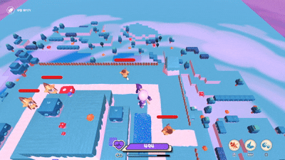
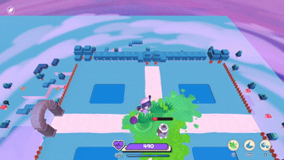
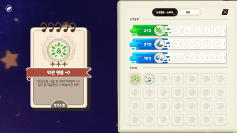

# PageFinder


<p align="center">
  
  
  
</p>

`PageFinder`는 3D 액션 로그라이트 게임으로, 플레이어의 행동이 전장에 '잉크'로 남고, 축적된 잉크를 활용해 다양한 특수 효과를 발동시켜 주어진 스테이지를 클리어하는 게임입니다.

<br>

## Project Overview

| 항목 | 내용 |
|---|---|
| 개발 기간 | 2024.03 ~ 2025.08 |
| 개발 인원 | 6명 팀 프로젝트(기획1, 프로그래머2, 그래픽3)|
| 플랫폼 | PC |
| 담당 역할 | Player, Reward, Growth, HUD|

<br>

## Tech Stack

- **Engine**: Unity 6(6000.0.34f1)
- **Language**: C#

<br>

## My Contributions

### 1. Player / Combat
- 플레이어 이동 및 연속 공격, 대쉬, 스킬, 피격 로직 구현
- 우선순위 기반 입력 처리로 이동, 공격, 대쉬 흐름 제어

### 2. Ability System
- 강화 단계에 따라 동작이 변경되는 Ability System 구현
- CSV 기반 Ability 데이터 관리를 통한 로직과 데이터 분리

### 3. Buff / Shield System
- 버프 적용 및 해제 흐름 구현
- Shield 상태 변경을 Event 기반으로 HUD와 연동

### 4. Ink System
- 플레이어 행동에 따라 전장에 잉크가 생성되는 흐름 구현
- 서로 다른 Ink간 합성 가능 여부를 판정하는 조건 시스템 설계

### 5. HUD / UI
- 플레이어 상태 변화에 따른 HUD 갱신
- 재사용 가능한 UI 컴포넌트 구성

### 6. 강화 카드 장착/해제 UI 및 데이터 관리 시스템 구현
- Drag &  Drop 기반 카드 장착/해제 구현
- 슬롯 상태와 장착 데이터 동기화
- 카드 데이터와 UI 표현 분리

<br>

## Architecture

```text
Input
  ↓
PlayerInputInvoker
  ↓
PlayerController
  ↓
ScriptBehaviour
  ↓
Damage / Generate Ink
  ↓
Enemy
  ↓
Reward
  ↓
Growth / UI
```

<br>

### 주요 클래스

| 클래스 | 역할 |
|---|---|
| [`PlayerInputInvoker.cs`](./PageFinder/Assets/02.Scripts/Entity/Player/PlayerInputInvoker.cs) | 플레이어 입력을 받고 우선순위에 따라 행동 Command 실행 요청 처리 |
| [`ScriptSystemManager.cs`](./PageFinder/Assets/02.Scripts/Script/ScriptSystemManager.cs) | 보상(Script) 데이터 파싱 및 생성, UI 연동 흐름 관리|
| [`EventManager.cs`](./PageFinder/Assets/02.Scripts/Mananger/EventManager.cs) | Observer 기반 이벤트 구독•해제 및 이벤트 전달 관리 |
| [`GeometryUtils.cs`](./PageFinder/Assets/02.Scripts/Utils/GeometryUtils.cs) | 잉크 합성 조건 판별 |
| [`Buff.cs`](./PageFinder/Assets/02.Scripts/Buff/Buffs.cs), [`CommandInvoker.cs`](./PageFinder/Assets/02.Scripts/Buff/CommandInvoker.cs) | Buff의 등록 및 실행 흐름 관리|
| [`UIManager.cs`](./PageFinder/Assets/02.Scripts/UI/UIManager/NewUIManager.cs) | UI Panel 등록•전환 및 관리, 게임 이벤트에 따른 UI 상태 전환 |

<br>

## Technical Highlights

### 1. 요구사항 변화에 대응한 Strategy 패턴 기반 Ability System 설계

#### 문제
초기에는 기본 공격, 대쉬, 스킬의 실행 로직을 각각의 Player Controller에서 직접 처리했습니다. 이후 강화 시스템이 추가되면서 기존 Ability에 새로운 기능을 조합할 필요가 생겨 Decorator 패턴을 적용했습니다. 그러나 강화가 단순한 부가 효과 추가를 넘어 Ability의 실행 로직 자체를 변경하는 형태로 확장되면서, Ability의 실행 로직 자체를 변경하는 형태로 확장되면서, Decorator만으로 다양한 행동 변화를 표현하기 어려워졌습니다.

#### 접근
Ability의 데이터와 행동 로직을 분리하고, IScript

#### 결과

- Player 클래스의 책임 감소
- 신규 Ability 추가 시 기존 코드 변경 최소화
- Ability 로직 재사용성 향상

---

### 2. 데이터 기반 성장 시스템

#### 문제

성장 요소가 증가하면서 코드 내부에 수치를 직접 작성하는 방식은  
유지보수와 밸런스 조정 비용이 커지는 문제가 있었습니다.

#### 접근

ScriptableObject와 외부 데이터를 활용하여  
게임 로직과 밸런스 데이터를 분리했습니다.

#### 결과

- 코드 수정 없이 성장 수치 조정 가능
- 데이터 관리 일관성 향상
- 콘텐츠 추가 비용 감소

<br>

## Links

- [Gameplay Video](링크)
- [Technical Documentation](링크)
- [Blog](링크)
- [Original Team Repository](링크)

